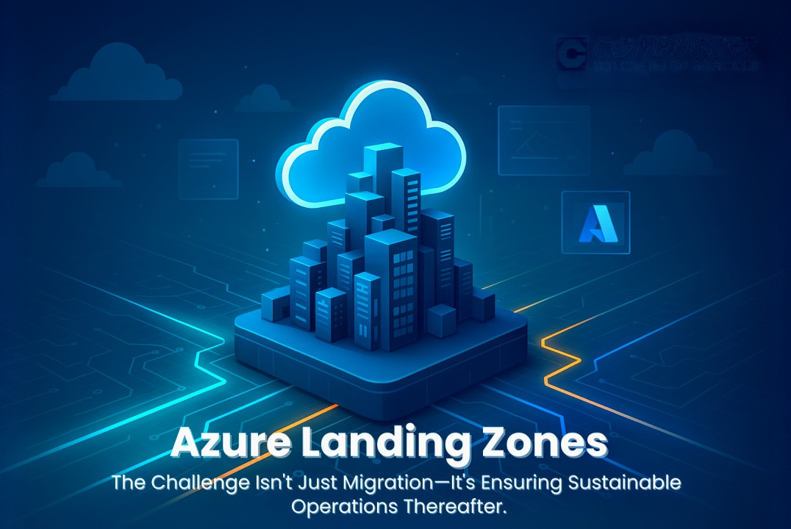

# Azure Landing Zone with Terraform



## Overview
This repository implements a **future-proofed Azure Landing Zone** following Microsoft’s [Cloud Adoption Framework (CAF)](https://learn.microsoft.com/en-us/azure/cloud-adoption-framework/ready/landing-zone/).

It provides:
- **Modular Terraform code** organized by platform, landing zones, and workloads.  
- **Management group hierarchy** aligned with CAF.  
- **Guardrails with Azure Policy** and policy-as-code.  
- **Shared services** for identity, networking, management, and security.  
- **Subscription vending** with governance controls.  
- **Baseline configurations** for corp and online landing zones.  
- **CI/CD pipelines** in Azure DevOps with validation, plan, apply, and approvals.  
- **Quality gates** (fmt, validate, tflint, tfsec).  

## Architecture
The architecture follows CAF’s eight design areas:

1. **Tenant and Identity**  
   - Management groups for Platform, Connectivity, Security, Management, Identity, Landing Zones.  
   - Azure Entra ID, RBAC, and managed identities.  

2. **Resource Organization**  
   - Hierarchical management groups.  
   - Subscription vending and placement under Corp, Online, Sandbox, and Decommissioned.  

3. **Network Topology and Connectivity**  
   - Hub VNet or Virtual WAN.  
   - Azure Firewall, Bastion, Private DNS Resolver.  
   - Optional ExpressRoute and VPN gateways.  

4. **Security**  
   - Microsoft Defender for Cloud plans.  
   - Microsoft Sentinel in a security subscription.  
   - Key Vault for platform secrets.  

5. **Management**  
   - Azure Monitor, Log Analytics, DCRs.  
   - Backup vaults and Site Recovery.  
   - Centralized alerts and action groups.  

6. **Governance**  
   - Policy initiatives for allowed locations, deny public IPs, and diagnostics.  
   - Policy as code with initiatives and assignments stored in source.  
   - Consistent tagging and cost management baselines.  

7. **Platform Automation and DevOps**  
   - Azure DevOps pipelines.  
   - Modular Terraform with remote state.  
   - Pre-commit hooks, standards enforcement, and quality gates.  

8. **Application Landing Zones**  
   - Corp and Online baselines.  
   - Workload models authored in YAML → converted into Terraform tfvars.  

## ASCII Architecture Diagram

```text
Tenant Root
│
├── Platform (MG)
│   ├── Identity (MG)
│   │    └── Identity Subscription
│   ├── Connectivity (MG)
│   │    └── Connectivity Subscription
│   │         ├── Hub VNet or vWAN
│   │         ├── Azure Firewall / Bastion
│   │         └── Private DNS Resolver
│   ├── Management (MG)
│   │    └── Management Subscription
│   │         ├── Log Analytics Workspace
│   │         ├── Action Groups
│   │         └── Backup Vault / ASR
│   ├── Security (MG)
│   │    └── Security Subscription
│   │         ├── Microsoft Sentinel
│   │         ├── Defender for Cloud Plans
│   │         └── Platform Key Vault
│   └── Sandbox (MG)
│        └── Sandbox Subscriptions
│
├── Landing Zones (MG)
│   ├── Corp (MG)
│   │    └── Corp Subscriptions
│   │         ├── Corp Baseline (RGs, NSGs, diagnostics)
│   │         └── Workloads (App Service, AKS, SQL, etc.)
│   └── Online (MG)
│        └── Online Subscriptions
│             ├── Online Baseline (RGs, NSGs, diagnostics)
│             └── Internet-facing workloads
│
└── Decommissioned (MG)
     └── Retired subscriptions
```

## Repository Structure

```text
.
├─ .config/                  # Global settings, tags, RBAC archetypes
├─ terraform/
│  ├─ modules/               # Reusable Terraform modules
│  ├─ platform/              # Tenant-wide platform stacks
│  ├─ landing-zones/         # Subscription vending & baselines
│  └─ providers/             # Provider versions and shared config
├─ environments/             # tfvars per environment (dev, test, prod)
├─ pipelines/                # Azure DevOps pipelines
├─ scripts/                  # Utility scripts (render models, enforce standards, etc.)
├─ tests/                    # TFLint, tfsec, Terratest
├─ docs/                     # Documentation
└─ diagrams/                 # Architecture diagrams
```

## Getting Started

### Prerequisites
- Terraform `>= 1.5.0`  
- Azure CLI `>= 2.55.0`  
- Access to an Azure DevOps project and service connection  
- tflint, tfsec (optional but recommended)  
- PowerShell 7+ for model rendering  

### Bootstrap
1. Create a storage account for Terraform state.  
2. Update `backend.tf` files with your state details.  
3. Configure `.config/global.json` for tags, RBAC, and standards.  

### Deploy Order
Apply stacks in this order:
1. **00-tenant** → Management group hierarchy  
2. **10-policy** → Policy definitions and assignments  
3. **20-identity** → Managed identities and RBAC  
4. **30-connectivity** → Hub VNet / vWAN  
5. **40-management** → Monitoring, DCR, backup  
6. **50-security** → Sentinel, Defender, Key Vault  
7. **60-vending** → Subscription vending  
8. **70-baselines** → Corp/Online subscription baselines  
9. **80-workload** → Workload models  

## CI/CD Pipelines
Azure DevOps pipelines are provided in `/pipelines`:

- **00-validate.yml** → linting and validation on PRs  
- **10–50** → platform layers  
- **60-vending** → subscription vending  
- **70-baseline** → corp and online baseline application  
- **80-workload** → model rendering and workload deployments  

Pipelines use reusable templates (`templates/terraform-steps.yml`, `quality-gates.yml`) for consistency.

## Scripts
- `render-model.ps1` → Converts YAML workload models into `*.auto.tfvars.json`  
- `enforce-standards.ps1` → Runs fmt, validate, tflint, tfsec across repo  
- `new-subscription.ps1` → Creates a new subscription alias using Azure REST  

## Tests
- **tflint** → static analysis of Terraform code  
- **tfsec** → security analysis of Terraform code  
- **Terratest** → Go-based tests that run `terraform validate` and `plan`  

Run with:
```bash
tflint --recursive
tfsec .
go test ./tests/terratest -v
```

